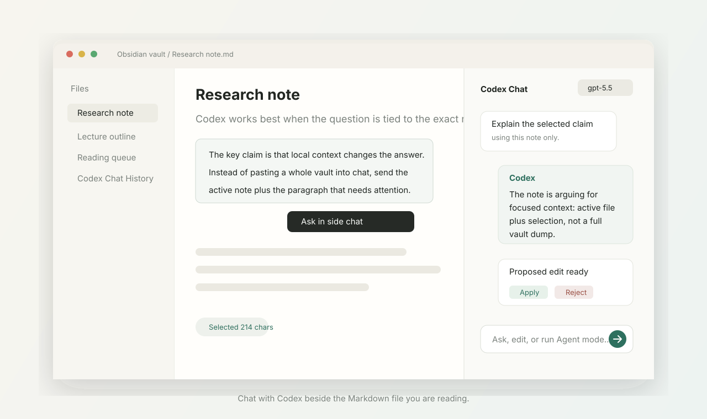

# Codex Chat Panel for Obsidian

[](https://github.com/hesong0222-dev/obsidian-codex-chat-panel/releases/latest)
[](https://github.com/hesong0222-dev/obsidian-codex-chat-panel/actions/workflows/ci.yml)
[](LICENSE)
[](https://obsidian.md)
[](https://github.com/hesong0222-dev/obsidian-codex-chat-panel/stargazers)

A native-feeling Obsidian side panel for chatting with Codex about the note you are reading.

Open a note, select the exact paragraph you care about, and ask Codex in the right sidebar. Codex Chat Panel can answer questions, explain selected text, propose reviewed Markdown edits, and save useful conversations back into your vault.

[Download the latest release](https://github.com/hesong0222-dev/obsidian-codex-chat-panel/releases/latest) · [Install](#30-second-install) · [Safe editing](#safe-editing) · [Roadmap](docs/ROADMAP_1_0.md) · [Report an issue](https://github.com/hesong0222-dev/obsidian-codex-chat-panel/issues/new/choose)



If this saves you from copying notes into a browser tab, a star helps other Obsidian users find it.

## Why People Star This

- **It stays in Obsidian.** The panel sits beside your note, keeps the current file in view, and renders Codex replies as real Markdown.
- **It uses your Codex CLI login.** No plugin-owned server, no separate API key flow, and no custom account system.
- **It is selection-first.** Drag text in the note and use quick actions like Ask, Explain, Summarize, Rewrite, Quiz, and Checklist.
- **It can edit notes without surprise writes.** Codex proposes a diff, then you choose Apply or Reject.
- **It has a safe Agent mode.** Larger workflows return a plan and reviewed file edits limited to the active note plus Markdown files you explicitly attach.
- **It is built for real vault work.** Extra context files, model picker, streaming status, chat export, stale-content checks, and practical defaults are already included.

## 30-Second Install

1. Install and log in to Codex CLI:

```bash
codex --version
codex login
codex debug models
```

2. Download `main.js`, `manifest.json`, and `styles.css` from the [latest release](https://github.com/hesong0222-dev/obsidian-codex-chat-panel/releases/latest).

3. Put those three files in your vault:

```text
YOUR_VAULT/.obsidian/plugins/codex-chat-panel/
```

4. In Obsidian, open `Settings -> Community plugins`, enable community plugins if needed, then enable `Codex Chat Panel`.

## What You Can Do

| Workflow | What happens |
| --- | --- |
| Ask about the active note | The current Markdown file is sent as context and the answer appears in the side panel. |
| Ask about selected text | Drag-select note text and use the floating `Ask in side chat` style actions. |
| Add more context | Attach a few extra Markdown files as labeled context chips. |
| Choose a model | Pick `gpt-5.5`, `gpt-5.4-mini`, or `gpt-5.3-codex-spark` next to the send button. |
| Stream responses | Codex CLI JSON events update the panel while the model is working. |
| Render Markdown | Headings, lists, links, code blocks, and inline code render as formatted content. |
| Edit the note | Codex returns structured edit JSON, the plugin shows a diff, and you approve the write. |
| Use Agent mode | Codex plans larger note workflows and returns one reviewed diff per proposed file change. |
| Save useful chats | Export the current conversation to `Codex Chat History/` inside your vault. |

## Modes

### Chat

The default mode for questions, summaries, explanations, and study prompts.

Open a note, type a question, and press `Enter`. Use `Shift+Enter` for a new line.

### Edit

Use Edit mode when you want Codex to rewrite the active note or selected text.

Examples:

```text
make this explanation shorter and clearer
turn this section into bullet points
fix the code comments in the selected block
rewrite this note as an exam checklist
```

The note is not changed immediately. Review the diff, then choose `Apply` or `Reject`.

### Agent

Use Agent mode when you want a larger note workflow, such as reorganizing a research note or updating several attached Markdown files.

Agent mode can inspect:

- the active note,
- selected text,
- Markdown files you explicitly add with `Add context...`.

Agent mode returns:

- a short plan,
- zero or more proposed edits,
- one reviewable diff per proposed file change.

## Safe Editing

Codex Chat Panel is intentionally conservative about writes.

- Chat calls run Codex with `--sandbox read-only`.
- Edit mode is limited to the active Obsidian note.
- Agent mode is limited to the active note and attached Markdown files.
- Edits are shown as diffs before anything is written.
- Each proposed edit needs explicit user approval.
- The plugin checks that a file has not changed since the proposal was generated.
- Large whole-note edits are blocked so you can select a smaller section instead.

You should still treat selected text and active notes as data you are intentionally sending through your local Codex CLI session.

## Privacy At A Glance

- No plugin-owned server.
- No separate API key storage.
- Uses your local Codex CLI session.
- Sends only the note context you choose to include.
- Chat history export is opt-in.
- Writes happen through Obsidian APIs after review.

## Models

The model picker focuses on practical Codex models for ChatGPT-account Codex usage:

| Model | Good for |
| --- | --- |
| `gpt-5.5` | Harder reasoning, editing, and Agent mode. |
| `gpt-5.4-mini` | Everyday note questions and shorter rewrites. |
| `gpt-5.3-codex-spark` | Fast study prompts, quick explanations, and lightweight chat. |

If a model fails, check your local Codex account:

```bash
codex debug models
```

## Settings

Open `Settings -> Codex Chat Panel`.

| Setting | Default | Notes |
| --- | --- | --- |
| Codex CLI path | `codex` | Use an absolute path if Obsidian cannot find the CLI. |
| Model | `gpt-5.5` | Same models as the panel picker. |
| Include active file | on | Sends the current note as context. |
| Include selection | on | Sends highlighted text when available. |
| Max active-file context | `24000` chars | Large notes are clipped in the middle. |
| Timeout | `180` seconds | Stops long Codex calls. |
| Answer language | Korean | Can be changed to English or match latest message. |

## Build From Source

```bash
git clone https://github.com/hesong0222-dev/obsidian-codex-chat-panel.git
cd obsidian-codex-chat-panel
npm ci
npm run build
npm run install-local -- /path/to/your/obsidian/vault
```

Then reload Obsidian and enable the plugin.

## How It Works

The plugin calls Codex CLI in JSON event mode:

```bash
codex exec \
  --model gpt-5.5 \
  --json \
  --skip-git-repo-check \
  --ephemeral \
  --ignore-user-config \
  --ignore-rules \
  --sandbox read-only \
  -C /path/to/vault \
  --output-last-message /tmp/obsidian-codex-answer.txt \
  -
```

The prompt includes:

- vault root
- active note path
- active note content
- highlighted selection, if any
- extra context files, if any
- recent chat turns
- latest user message

The panel listens to Codex JSONL events for status updates and assistant messages. It still reads `--output-last-message` as a final fallback, so noisy CLI logs do not show up in the chat.

In Edit mode, Codex must return structured JSON:

```json
{
  "operation": "replace_selection",
  "content": "updated Markdown",
  "summary": "what changed"
}
```

The plugin then shows a diff preview. The result is written only after you choose `Apply`.

## Troubleshooting

### Obsidian Says Codex Failed

Run this in a terminal:

```bash
codex exec --model gpt-5.5 --sandbox read-only --skip-git-repo-check "Reply with ok"
```

If that fails, fix Codex CLI login or model access first.

### Obsidian Cannot Find `codex`

Set an absolute path in plugin settings.

Common macOS paths:

```text
/opt/homebrew/bin/codex
/usr/local/bin/codex
```

### Selection Is Not Sent

Make sure `Include selection` is enabled in settings. Then select text in the note before clicking the panel.

The panel shows `Selected N chars` when it has captured a selection. When possible, the note also shows quick actions beside the selected text.

## Development

```bash
npm ci
npm run dev
npm run build
npm run check
```

The generated Obsidian files are:

- `main.js`
- `manifest.json`
- `styles.css`

## Release Checklist

1. Bump `version` in `manifest.json`, `package.json`, `package-lock.json`, and `versions.json`.
2. Run `npm run check`.
3. Commit changes.
4. Tag the version:

```bash
git tag 1.0.1
git push origin main --tags
```

GitHub Actions uploads the three release files.

## Roadmap

- Submit to the official Obsidian community plugin directory.
- Add BRAT install instructions.
- Add optional prompt preset editing.
- Add smarter model availability detection from `codex debug models`.
- Add keyboard-first quick action shortcuts.
- Add a small public demo video with a clean sample vault.

## Contributing

Small, practical improvements are welcome. Please keep the panel quiet, fast, and note-first.

Good first issues:

- polish the Obsidian theme integration,
- improve selection behavior across editor modes,
- add tests around diff parsing and stale-content checks,
- write a clean sample vault for screenshots and demos.

Before opening a PR:

```bash
npm run check
```

## License

MIT.
